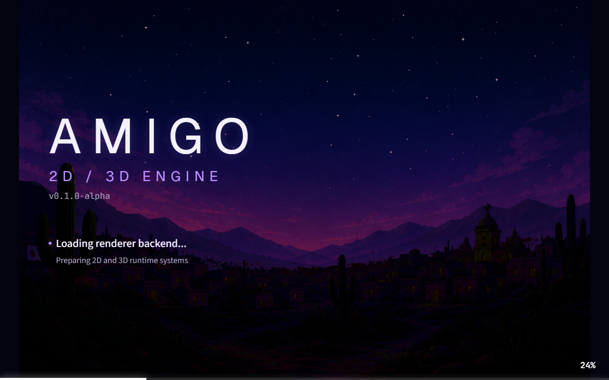
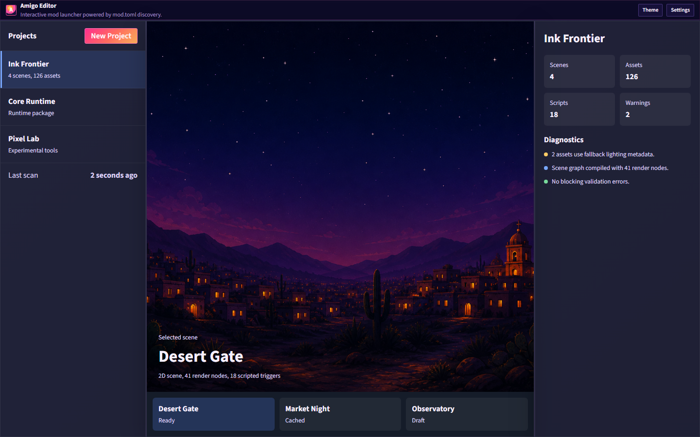
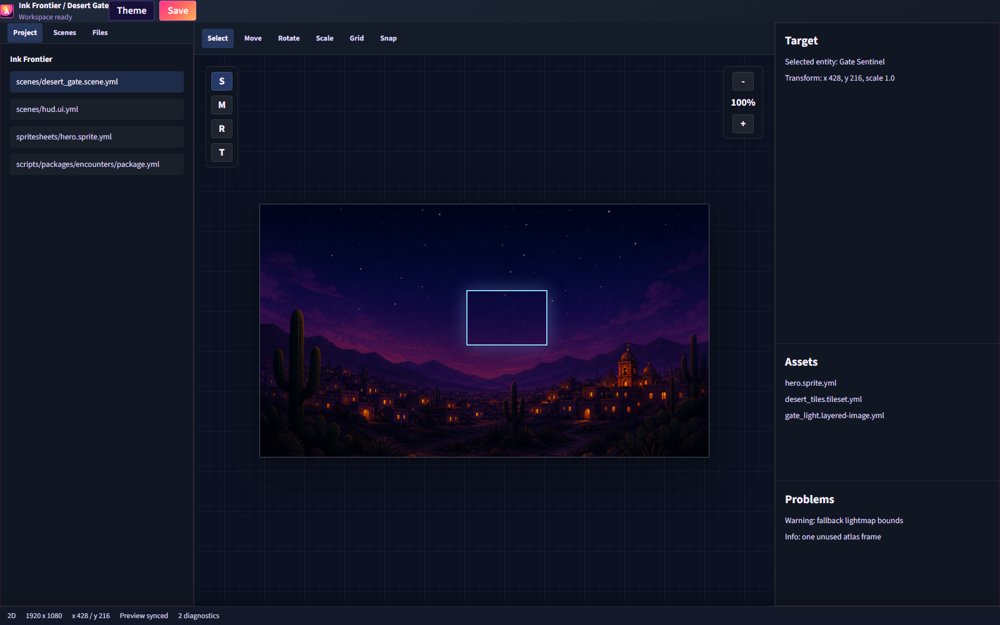

# Amigo Editor

Desktop asset explorer and lightweight asset editor for Amigo mods.

Current milestone: startup dialog shell from `docs/tasks/editor/001`.

## Scripts

```txt
npm install
npm run dev
npm run screenshots
npm run build
npm run tauri:dev
```

The first screen uses static startup data. Tauri commands for real mod scanning are intentionally left as the next integration step.

## Screenshots

The screenshot harness renders deterministic frontend-only views through Vite, without launching the Tauri desktop shell:

```txt
npm run screenshots
```

Generated images are written to `screenshots/`:




